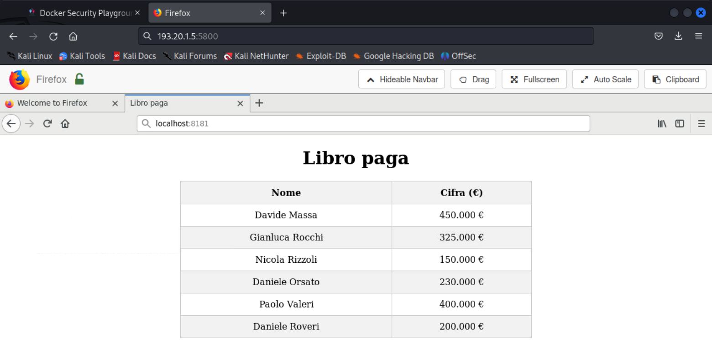

# Over the fire(wall) [Network Security - Project]

Network Security project about Phishing and SSH.

## Background Scenario

Our laboratory aims to simulate a real-world scenario where Luciano, an attacker, attempts to access a protected server containing sensitive information. For security purposes, this server is configured to allow access solely from a specific IP address associated with the system's admin, Massimiliano.

Objectives:

1. Analyze the network to identify Massimiliano's IP.
2. Luciano must find potential vulnerabilities or techniques to bypass the IP-based firewall set by Massimiliano.
3. Gain access to the protected server and retrieve the sensitive information from it.

## Scenario 


During the demonstration scenario, we use these IPs:

- 193.20.1.1 - Company Network

- 193.20.1.2 - Protected Web Server

- 193.20.1.3 - SMTP server

- 193.20.1.4 - Admin Employee (Massimiliano) PC on company network

- 193.20.1.5 - Luciano PC on company network (Firefox and SSH client)

- 193.20.1.6 - Luciano PC on company network (Hack tools including nmap, netcat and setoolkit)
  
## Phases
1. Footprinting: gather information online about the organization and its systems.
2. Scanning: scan vulnerable point of access.
3. Enumeration: intrusive probing of vulnerable services.
4. Exploitation: attack those potential vulnerability.

## Docker HUB
For our purposes a new docker image is created for the attacker's machine following these steps: 

1. A Dockerfile is created as follows:


2. The image "hacker_host" is created through the "docker build" command:
   
```
docker build -t hacker_host .
```

3. The new image is pushed on our public Docker HUB repository for future use:
   
```
docker login
docker tag hacker_host lauranaddei/hacker_host
docker push lauranaddei/hacker_host
```


### Footprinting

In this case scenario we're already connected to the local network, so we've already gathered enough information about our target.

We start by finding out our IP address on the networks using ifconfig command:


Then, we discover some IPs using then nmap tool with these options:

```
nmap -sn -PE --send-ip 193.20.1.0/24
```

- “-sn” means “no port scan”.
- “-PE” sends ICMP Echo Request.
- “--send-ip” to not send ARP packets.


### Scanning
We're interested in the open services on the network so we can scan it more aggressively.

If we use simply a TPC SYN scan from nmap, we find vague information. In particular, nmap is used with the following flag:

```
nmap -sS [IP_address]
```

- -sS: TCP SYN

Scanning for the Protected Web Server:


As we can see all the scanned port are filtered.
When we try to access to 193.20.1.2:


This happens because iptables rules were previously set for the 193.20.1.2 IP (Protected Web Server) in order to provide the access to the Web Server only by the 193.20.1.4 IP (Massimiliano PC) as shown:

```
iptables -A INPUT -s 193.20.1.4 -j ACCEPT
iptables -A INPUT -j DROP
iptables -L
```


Scanning for Massimiliano's host:


Scanning for the SMTP Server:


### Enumeration
Instead, if we explore deeply with a Version Detection scan through nmap, we can obtain service fingerprints on the hosts.
In particular, nmap is used with the following flag:

```
nmap -sV [IP_address]
```
- -sV: probe open ports to determine service/version info.

Enumeration for Massimiliano's host:


On Massimiliano PC, we find an OpenSSH open port.

It was previously opened on Massimiliano PC through the command:

```
/usr/sbin/sshd
```

Enumeration for the SMTP Server:


We have now discovered about the SMTP server opened on the 25 port.

Our purpose is to find out Massimiliano's username in the intranet context.

Massimiliano's credentials into the intranet context are previously set as:

```
adduser massimiliano
password: forzajuve
```

The first step is to connect manually to the SMTP server and try verifying some users.

The netcat command is used with the following flags:

```
netcat -nv 193.20.1.3 25 
```

- -n, --noodns: do not resolve hostnames via DNS
- -v, --verbose: set verbosity level (can be used several times)

  

To automatize the research operation, the script "smtp-user-enum.pl" is used to enumerate SMTP users using the VRFY command. In order to use this script you need to attach and use the following hack tool: nsunina/smtp-user-enum.

It is lauched with a list of possible Massimiliano Allegri usernames generated by AI "unix_users.txt". You can find the "unix_users.txt" file in this repository.


```
smtp-user-enum.pl -M VRFY -U unix_users.txt -t 193.20.1.3
```


We find out the matching with "massimiliano" as username.

### Phishing

Our purpose is stealing Massimiliano's password. 

At first, we use the setoolkit tool with the scope of cloning the Linkedin login web page.


As shown, any request to the 193.20.1.6 IP is mapped to the fake Linkedin login page and every access to that page will be tracked by setoolkit.

Now, we need to trick Massimiliano into accessing our cloned site by sending him a phishing email:


Once Massimiliano click the fake link provided by the email, he'll be redirected to the fake login page.

Massimiliano inserts his access credentials and will be redirected to the real Linkedin login page.


On setoolkit we discover Massimiliano's password:


### Local Port Forwarding

```
ssh -L 8181:193.20.1.2:80 massimiliano@193.20.1.4
```

We can use Massimiliano OpenSSH open port to set up an ssh tunnel with him. 
The local port forwarding tecnique is used to bypass the firewall by forwarding the client machine port 8181 to the server machine port 80 via the Massimiliano's PC.


Now, we are able to bypass the firewall accessing to the Protected Web Server from localhost:8181.




